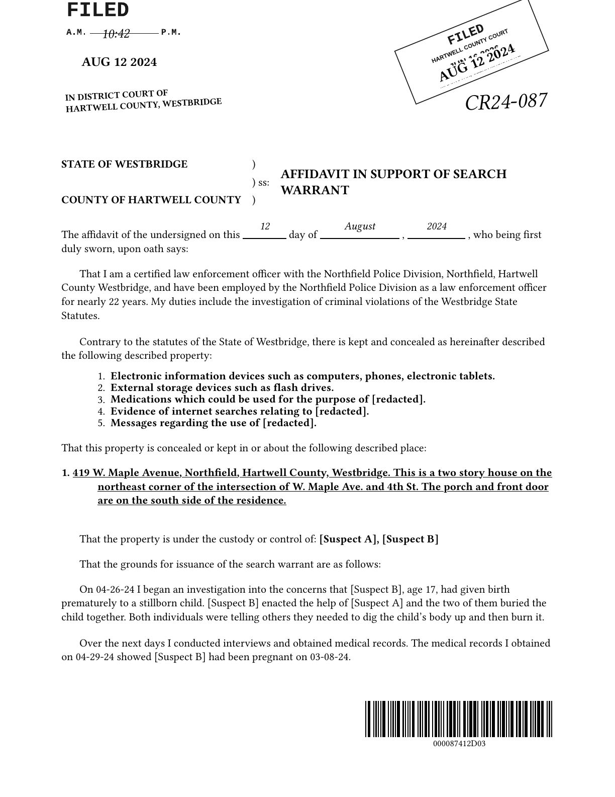
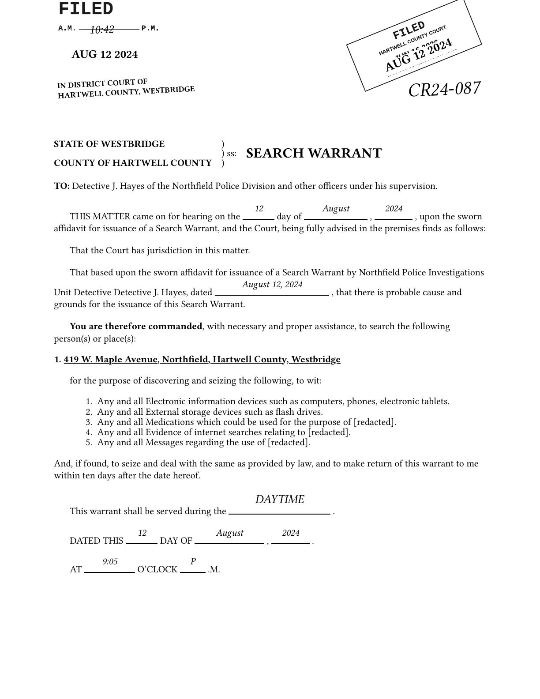
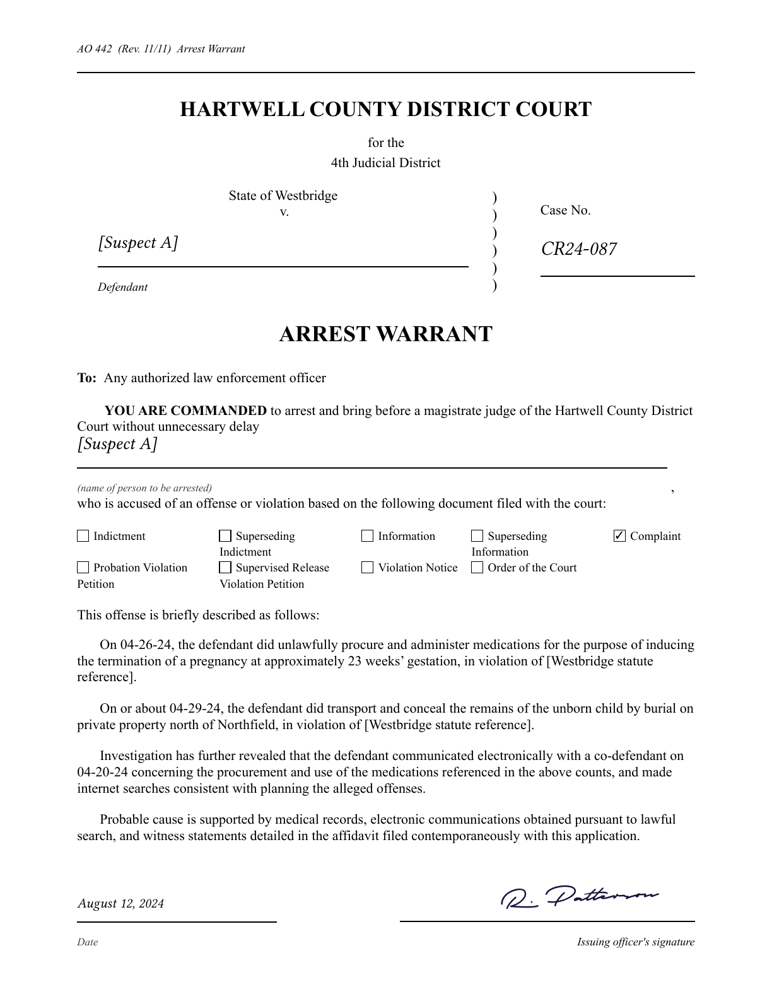
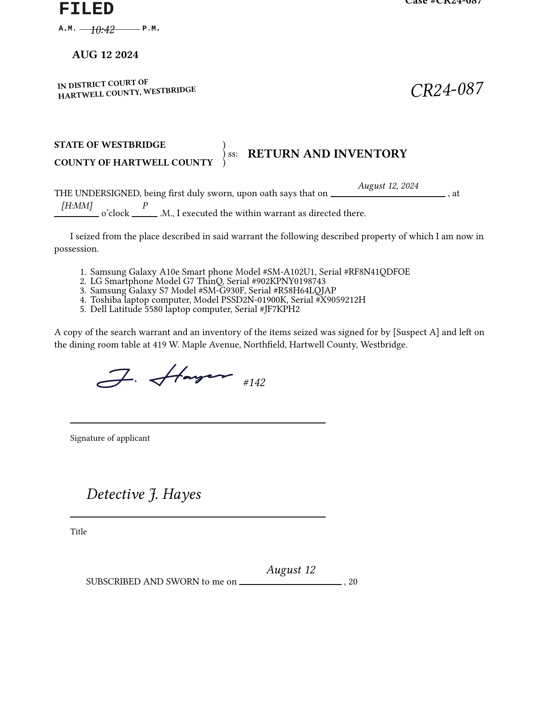
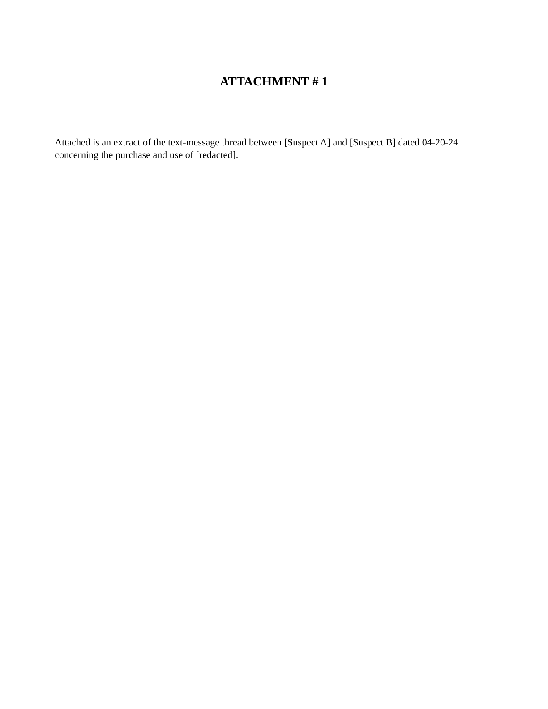
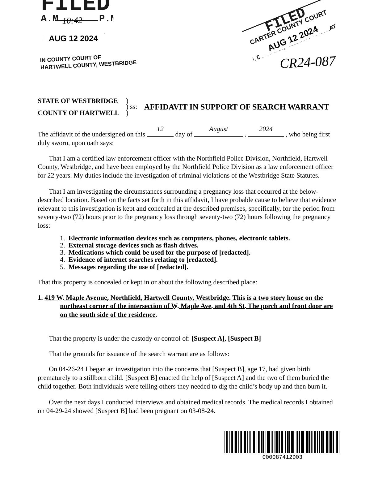

# warrant-vignette


A Quarto + Typst extension that makes it easy to create mock realistic-looking search-warrant and
arrest-warrant materials for use in psychology-law research vignettes. Each
packet of materials can include some combination of an affidavit, a search
warrant, an arrest warrant, an attachment cover sheet, an evidence
exhibit (Options include: Social media records, texts, browser search history
or search history, photo log), and a return-and-inventory page.

Each output is stamped with fictional jurisdictional seals and signed
with stylized procedural signatures, so the rendered PDFs read as
photocopied court documents at typical on-screen zoom. You 

This repository hosts the canonical extension plus a small set of
example `.qmd` files that exercise each render path. The R functions
that drive the extension (asset builders, photocopy
post-processor, batch render driver) live in the companion
[warrantR R package](https://github.com/emmarshall/warrantR).

## Layout

```
warrantr-typst/
├── _extensions/warrant-vignette/   # the extension (canonical source)
├── figures/                        # logo + example previews
├── affidavit-only.qmd              # render: affidavit pages only
├── arrest-warrant-only.qmd         # render: arrest warrant only
├── return-only.qmd                 # render: return-and-inventory only
├── warrant-only.qmd                # render: search warrant only
├── test-warrant.qmd                # render: full packet
├── exhibit-only.qmd                # exhibit: text messages
├── exhibit-browser.qmd             # exhibit: browser / search history
├── exhibit-photos.qmd              # exhibit: photo log
├── exhibit-geofence-warrant.qmd    # exhibit: geofence warrant attachment
├── exhibit-geofence-anonymized.qmd # exhibit: Sensorvault Step 1 / 2 table
├── exhibit-geofence-summary.qmd    # exhibit: per-device aggregate
├── exhibit-geofence-subscriber.qmd # exhibit: Sensorvault Step 3 CSI
├── exhibit-account-audit.qmd       # exhibit: Google audit record
├── exhibit-location-timeline.qmd   # exhibit: Maps Timeline place visits
├── exhibit-search-activity.qmd     # exhibit: My Activity search feed
├── RENDERS.md                      # reference for the example .qmd entry points
└── TESTING.md                      # local sanity-check workflow
```

## Quick start

From this directory, with [Quarto](https://quarto.org/) (>= 1.5.0)
on your `PATH`:

```bash
quarto render test-warrant.qmd
```

The output is `test-warrant.pdf`, a clean, multi-page packet
containing an affidavit, attachment, exhibit, search warrant, and
return-and-inventory.

To get the photocopy-aged version on top of the clean render, use
the R companion package:

```r
# install once
install.packages("pak")
pak::pak("emmarshall/warrantR")

library(warrantR)
render_warrant(
  qmd_path        = "test-warrant.qmd",
  output_pdf      = "stim/test-warrant.pdf",
  output_pages_dir = "stim/test-warrant_pages",
  photocopy_level = "moderate",
  seed            = 4747
)
```

## Examples

Each preview shows page 1 of the corresponding rendered PDF
(default Carter County jurisdiction, no photocopy effect). Click an
example to see the full output PDF in the repo root.

<table>
  <tr>
    <td align="center">
      <a href="affidavit-only.pdf"></a><br/>
      <sub><b><a href="affidavit-only.qmd">affidavit-only.qmd</a></b></sub><br/>
      <sub>Affidavit in Support of Search Warrant</sub>
    </td>
    <td align="center">
      <a href="warrant-only.pdf"></a><br/>
      <sub><b><a href="warrant-only.qmd">warrant-only.qmd</a></b></sub><br/>
      <sub>Search Warrant</sub>
    </td>
  </tr>
  <tr>
    <td align="center">
      <a href="arrest-warrant-only.pdf"></a><br/>
      <sub><b><a href="arrest-warrant-only.qmd">arrest-warrant-only.qmd</a></b></sub><br/>
      <sub>Arrest Warrant (AO 442 form style)</sub>
    </td>
    <td align="center">
      <a href="return-only.pdf"></a><br/>
      <sub><b><a href="return-only.qmd">return-only.qmd</a></b></sub><br/>
      <sub>Return and Inventory</sub>
    </td>
  </tr>
  <tr>
    <td align="center">
      <a href="exhibit-only.pdf"></a><br/>
      <sub><b><a href="exhibit-only.qmd">exhibit-only.qmd</a></b></sub><br/>
      <sub>Attachment cover + text-message exhibit</sub>
    </td>
    <td align="center">
      <a href="test-warrant.pdf"></a><br/>
      <sub><b><a href="test-warrant.qmd">test-warrant.qmd</a></b></sub><br/>
      <sub>Full packet (affidavit + attachment + exhibit + warrant + return)</sub>
    </td>
  </tr>
</table>

### Additional exhibit examples

The repo also includes nine `exhibit-*.qmd` entry points covering
every built-in exhibit type. The four shown above are the only ones
with committed preview PDFs; render the others locally to see them:

| `.qmd`                                | Mimics                                              |
| ------------------------------------- | --------------------------------------------------- |
| `exhibit-browser.qmd`                 | Forensic browser / search-history table             |
| `exhibit-photos.qmd`                  | Chain-of-custody photo grid                         |
| `exhibit-geofence-warrant.qmd`        | Geofence warrant attachment (lat/lon, radius)       |
| `exhibit-geofence-anonymized.qmd`     | Sensorvault Step 1 / 2 anonymized location table    |
| `exhibit-geofence-summary.qmd`        | Per-device aggregate of Sensorvault returns         |
| `exhibit-geofence-subscriber.qmd`     | Sensorvault Step 3 subscriber-info / CSI return     |
| `exhibit-account-audit.qmd`           | Google audit record of LH opt-in / device events    |
| `exhibit-location-timeline.qmd`       | Google Maps Timeline place visits, day-grouped      |
| `exhibit-search-activity.qmd`         | Google "My Activity" search & web feed              |

```bash
quarto render exhibit-geofence-anonymized.qmd
# ... etc.
```

## Documentation

- [`RENDERS.md`](RENDERS.md): the example render entry points and
  what each one produces.
- [`TESTING.md`](TESTING.md): local sanity-check workflow and the
  three render paths (standalone Typst, Quarto, full R pipeline).
- [`_extensions/warrant-vignette/README.md`](_extensions/warrant-vignette/README.md):
  full reference for every YAML field, every `exhibit-type`, and
  every asset path. This is the canonical reference document.

## Required fonts

Two font families need to be available to Typst at render time.
Both ship with most Linux distributions and TeX Live; on macOS
install through Homebrew or Font Book.

**Liberation Serif / Sans / Mono** are the body and stamp typefaces.
On macOS: `brew install --cask font-liberation`.

**Autograf PERSONAL USE ONLY** is the handwriting font used for
signatures. The font ships inside the extension at
`_extensions/warrant-vignette/assets/fonts/Signature/`. Install it
system-wide before the first render. If it is missing, the template
falls back to Bradley Hand and then Caveat.

## Customizing the jurisdiction

The bundled assets render with a default Carter County jurisdiction
(clerk M. Donovan, judge Hon. R. Patterson, notary M. Doyle, and
detective J. Hayes). To swap in a different jurisdiction without
editing the extension source, use the warrantR package's `add_*()`
helpers and override the matching `*-asset` fields in your `.qmd`
YAML. The
[customize-jurisdiction vignette](https://emmarshall.github.io/warrantR/vignettes/customize-jurisdiction.html)
walks through the full workflow.

## License

The extension code is released under MIT. See
[`LICENSE`](LICENSE). Bundled fonts and assets carry their own
licenses; confirm font licensing before publishing or distributing
rendered stimuli.
